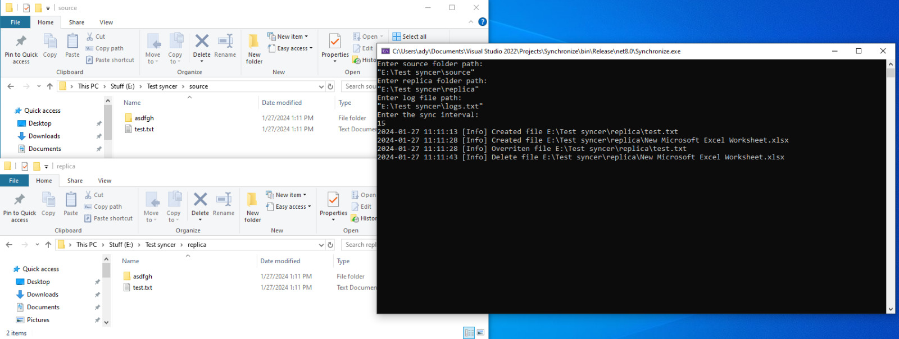

# Synchronize
A simple command line tool to synchronize two folders at a specific interval

## Usage

### Windows
Double click the executable and follow the on screen instructions to input the folder paths, the log file path and the sync interval



### Linux

** Install dotnet runtime for Linux
** Run in command line:
``` bash 
dotnet Synchronize.dll
```

** Follow the on screen instructions to input the folder paths, the log file path and the sync interval


## Requirements
.NET 8.0 or later
